# ImmunHelden: Hintergründe und Erkenntnisse

Das [Kernteam des Projekts *ImmunHelden*](https://devpost.com/software/immuneheros) formierte sich im Zuge des [#WirVsVirus Hackathons](https://de.wikipedia.org/wiki/WirVsVirus) von 20. bis 22. März 2020 aus Personen verschiedener Regionen Deutschlands. Die gemeinsame Idee der rein virtuellen Gruppe war, dass Personen die von einer Infektion mit [Sars-CoV-2](https://de.wikipedia.org/wiki/SARS-CoV-2) genesen sind, eine Immunität gegen das Virus entwickelten und ihnen eine wichtige Rolle bei der Bewältigung der sozioökonomischen Auswirkungen der Pandemie zukommen könnte.

## Ausgangspunkt

Getrieben von der exponentiellen Zunahme der registrierten Infektionszahlen bis Anfang April 2020, lag unser Fokus auf der Lösung akuter Probleme: könnte die Ausbreitung des Virus' nicht gebremst werden, käme es bald zu Engpässen bei der Versorgung der Gesellschaft, da sich eine Vielzahl von Mitarbeitern in der [kritischen Infrastruktur](https://de.wikipedia.org/wiki/Kritische_Infrastrukturen) gleichzeitig in Quarantäne begeben müsste. Es drohten Schließungen von Supermärkten, Apothekten sowie Einrichtungen zur Energie- und Wasserversorgung. Das Gesundheitssystem würde durch die Ausbreitung von Infektionen innerhalb des Personals und einen gleichzeitigen Ansturm von Patienten mit einem schweren Krankheitsverlauf doppelt belastet.

Während des Hackathons und der darauf folgenden Woche entwickelten [wir eine einfache Webseite](https://immuneheroes-35036.firebaseapp.com/), die sich an zwei Gruppen richtete: Einerseits an Menschen, die davon ausgingen selbst bereits eine Coronainfektion durchgemacht zu haben; andererseits an Privatpersonen die Hilfe benötigten und Einrichtungen die unter Personalknappheit litten oder sehr kontaktintensive Aufgaben zu vergeben hatten. Unser Ziel war, diese beiden Gruppen möglichst gut miteinander zu vernetzen.

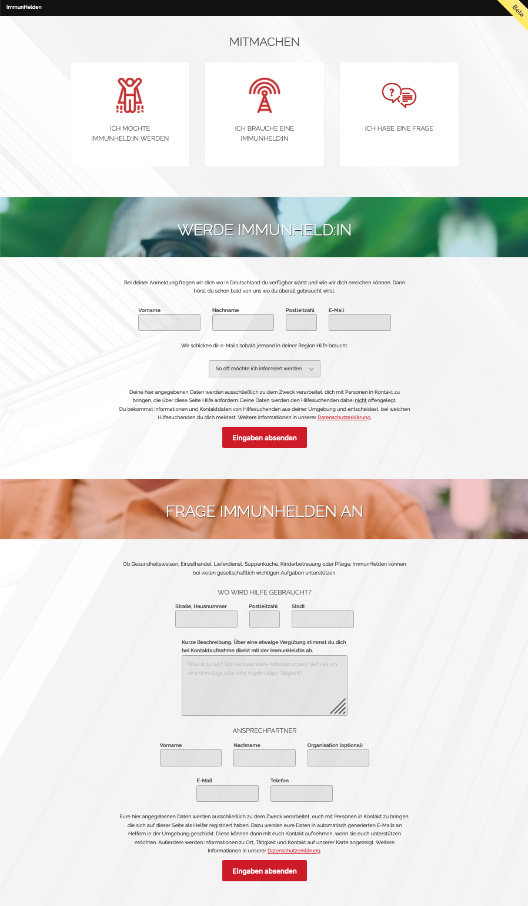

### Start im #WirVsVirus Solution Enabler

Nach dem Hackathon war unser Projekt zwar nicht direkt unter den Top-20 der Jury, wir hatten uns aber trotzdem auf gut Glück für eine Teilnahme am Solution Enabler Programm und eine Förderung durch das BMBF beworben. Dafür hatten wir uns ein langfristigeres Ziel gesetzt: das Potential von Genesenen zum Wohle der Gesellschaft nutzbar zu machen.

Zu unser aller Begeisterung wurden beide Bewerbungen akzeptiert und so machten wir uns ab April 2020 zusammen mit vielen anderen Initiativen, einem wachsenden Team und unter Supervision von ProjectTogether auf den Weg in eine ereignisreiche Zeit, die geprägt war von virtueller Zusammenarbeit in E-Mails, Zoom Calls, Google Docs, Slack Channels, Pull Requests, Spreadsheets, Markdown, Podcasts und vielem mehr.

## Das Plattformmodell

Die Entwicklung unserer Webseite und der damit verbundenen Vermittlung von Hilfskräften an gemeinnützige Einrichtungen basiert auf dem für digitale Märkte typischen Plattformmodell im sogenannten [Two-Sided Market](http://plattform-maerkte.de/wp-content/uploads/2015/10/Kompendium-I40-Analyserahmen.pdf). In der Rolle des *Plattformbetreibers* erstellt und pflegt unser Team die Webseite und die Kommunikationsinfrastruktur und stellt damit die Grundlage der Plattform bereit. Die Inhalte der Plattform werden von der *Angebotsseite* des Markts, den gemeinnützige Einrichtungen, in Form von Anzeigen oder Hilfegesuchen selbst erstellt und gepflegt. Die *Nachfrageseite* des Markts bilden die ehrenamtlichen Hilfskräfte, die sich dank unserer Infrastruktur bequem und einfach über Möglichkeiten zum gemeinnützigen Engagement in ihrer Nähe informieren können.

### Mehrwert

Der Plattformbetreiber erzeugt für die Gesamtheit des Markts einen Mehrwert, den die einzelnen Akteure auf beiden Seiten nicht selbstständig leisten können. Der Schlüssel für diesen Mehrwert liegt in der Kombination aller Inhalte der Angebotsseite in einer für die Nachfrageseite relevanten Eigenschaft. In unserem konkreten Fall ist das die räumliche Nähe zwischen den Standorten der gemeinnützigen Einrichtungen und den Wohnorten der ehrenamtlichen Hilfskräfte. Denn Studien haben gezeigt, dass die Distanz zum Wohnort eine wesentliche Rolle für die Bereitschaft zur Ausübung einer ehrenamtlichen Tätigkeit spielt [TODO: Quelle wiederfinden].

Einzelne gemeinnützige Einrichtungen haben allein oft nicht genügend Standorte, um ein flächendeckendes Angebot für Hilfskräfte zu schaffen. Für potentielle Hilfskräfte wiederum bedeutet es einen hohen initialen Aufwand sich einen Überblick über die Einrichtungen in der näheren Umgebung zu verschaffen und über deren Hilfegesuche kontinuierlich auf dem Laufenden zu bleiben. Das erhöht die Einstiegshürde und verringert die Anzahl potentieller Kandidaten.

Konzeptionell besteht in der Vermittlung ehrenamtlicher Tätigkeiten basierend auf einer Ortsangabe für ein Plattformmodell also die Möglichkeit einen gesellschaftlichen Mehrwert zu generieren.

Hinzu kommen die Vorteile der Aufgabenteilung, da sich alle beteiligten Akteure auf ihr Kerngeschäft konzentrieren und damit Kosten sparen können. In profitorientierten Märkten ist dies oft die treibende Kraft bei der Etablierung neuer Plattformen, denn der Aufbau digitaler Kompetenz innerhalb von bestehenden Firmenstrukturen ist immer zäh und langwierig. Aus dieser Position heraus eigene Systeme zu entwickeln, ist in der Regel riskant und fehleranfällig. Gerade hier sehen wir auch im öffentlichen und gemeinnützigen Sektor die Chance bestehende Prozesse über Plattformmodelle effizient durch digitale Angebote zu ergänzen.

### Iteratives Entwicklungsmodell

Besondere Aufmerksamkeit bei Plattformprojekten gilt der engen Verzahnung von technischer Entwicklung, strategischer Ausrichtung, Expansion und der Rückführung von Nutzerfeedback.  Vielversprechend sind hierbei iterative Entwicklungsmodelle. Ausgehend von einer initialen Version und Nutzergruppe werden dieselben Schritte immer wiederholt: eine neue Expansionsstufe wird geplant, die nötigen Features entwickelt, neue Nutzer gewonnen und deren Feedback eingesammelt. Dieses wird zusammen mit Statistiken zum Zuwachs der Plattform ausgewertet, um zu entscheiden wie erfolgreich die Iteration war.

Gegenüber anderen Ansätzen wie dem Wasserfallmodell, bieten iterative Entwicklungsmodelle einen entscheidenden Vorteil für neuartige und spekulative Projekte: sie räumen dem Entwicklungsteam einen hohen Grad an Flexibilität ein. Damit können in kurzer Zeit und mit vergleichsweise geringen Kosten verschiedene Ideen und Strategien unter realen Bedingungen "im Markt" getestet und abgewogen werden. Die isolierte Betrachtung einer technischen Entwicklung ohne die Einbeziehung externer Faktoren oder der zugrundeliegenden Strategie ist dann jedoch selten zielführend.

### Problematik des initialen Angebots

Die Schaffung eines initialen Angebots ist die inhärente Herausforderung des *Two-Sided Market*. Denn der Plattformbetreiber selbst ist nur Vermittler und kann weder Angebot noch Nachfrage initiieren. Stattdessen müssen sowohl Partner auf der Angebotsseite als auch Kunden auf der Nachfrageseite gewonnen werden. (Und das zu Beginn ohne eine große Nutzerbasis auf der jeweils anderen Seite als Argument nutzen zu können.)

## Strategische Ausrichtung zu Beginn der Pandemie

Der Beginn der Pandemie in Deutschland im März und April 2020 zeichnete sich aus durch ein zunächst exponentielles Anwachsen und anschließend langsamen Rückgang der registrierten Neuinfektionen durch die verhängten Kontaktbeschränkungen.

### Boom des Freiwilligen Engagements

Diese Situation versprach günstige Voraussetzungen für die Schaffung eines initialen Angebots auf unserer Plattform. Die Hilfsbereitschaft in der Bevölkerung war im März und April 2020 so groß, dass sich auf digitalen Plattformen wie nebenan.de oder quarantäneheld.org an einigen Orten auf ein einziges Gesuch zur Nachbarschaftshilfe rechnerisch bis zu 20 Helfer meldeten.

Im Handlungfeld *Helfer:innen/Ehrenamt* des WirVsVirus Solution Enabler Programms wurde die Situation von anderen Initiativen ähnlich eingeschätzt. Zu dieser Zeit war die vorrangige Fragestellung der Gruppe von Projektinitiatoren, warum sich ein beträchtlicher Anteil der Menschen davor scheut auf Onlineplattformen um Hilfe zu bitten und wie man ihnen entgegenkommen könnte.

### Vermittlung an Organisationen

Während wir eine Vermittlung an Privatpersonen für unser Projekt zu Beginn noch erwogen hatten, war es zu diesem Zeitpunkt bereits nicht mehr relevant. Im Laufe des April 2020 hatte sich herausgestellt, dass die Vorstellung einer pauschalen Immunität wisschenschaftlich und eine Bevorzugung von betroffenen Menschen gesellschaftlich nicht tragbar sind. Beim Wechsel unseres Fokus’ von Immunität auf Genesung wurde uns schnell klar, dass die Vorteile für Privatpersonen zu gering und die rechtlichen Risiken für uns als Plattformbetreiber in dem Fall zu hoch sind. Damit war die Vermittlung an Organisationen für uns beschlossen.

### Interaktive Karte als Asset

Das deutliche Überangebot an Freiwilligen in der Zeit der Kontaktbeschränkungen war natürlich nur ein Indiz für uns, denn tatsächlich waren zu diesem Zeitpunkt nur Bruchteile der Gesellschaft von einer Infektion genesen. Unser Fokus sollte daher zunächst darauf liegen Organisationen zu erreichen und das erschien schwieriger. Da direkte Kontaktaufnahmen selten beantwortet wurden, bestand unser erster Versuch darin unsere [interaktive Karte](https://github.com/ImmunHelden/WirVsVirusMap) für andere Initiativen zugänglich zu machen. Unsere Hoffnung war es darüber Angebote zu bündeln und gemeinsam an Reichweite zu gewinnen.

Die Plattform [QuarantaeneHelden.org](https://www.quarantaenehelden.org) hatte sich seit März erstaunlich schnell verbreitet, basierte aber noch auf Postleitzahllisten. Eine Kooperation auf Basis unserer Karte wäre für uns sehr medienwirksam gewesen, kam von unserer Seite aber letztlich zu spät: am 10. April hatten sie bereits [eine eigene digitale Karte implementiert](https://twitter.com/QuarantaeneHeld/status/1248581649677398016). In der Folge haben wir Rahmen des WirVsVirus Solution Enabler Programms weiter aktiv zur gemeinsamen Verwendung unserer Karte geworben.

Kurzzeitig waren wir für eine Kooperation mit dem Projekt [Hilferegister.org](https://www.hilferegister.org/) im Gespräch, was sich schließlich aber für eine Listendarstellung entschieden hat, da diese leichter zu sortieren und filtern war.

### Strikte Linie im Datenschutz

Neben einer guten Kompatibilität für mobile Endgeräte und einer leichten Integration der Karte in andere Webseiten, setzten wir auf eine strikte Datenschutzhaltung: Niemand sollte befürchten müssen, dass die Daten der eigenen Nutzer über eine gemeinsame Komponente aufgezeichnet oder weitergegeben werden könnten. In der Instrustie sind datenschutzrechtliche Bedenken oft ausschlaggebend für Entwicklungsvorhaben die gemeinsam voran getrieben oder an Dritte delegiert werden.

Als Plattform die so wenig Daten wie möglich von ihren Nutzern sammelt und dies auch nach außen bewirbt, sahen wir uns für Kooperationen gut aufgestellt. Dieses vorsichtige Vorgehen passte auch zu unserer Prämisse möglichst keine Gesundheitsdaten zu speichern, denn das würde strengere Regelungen zum Ort und der Dauer der Speicherung nach sich ziehen.

Nach wie vor war nicht abschließend geklärt, ob unsere Nutzer mit einer Anmeldung bereits eine Selbstauskunft zu ihrer Genesung von Sars-CoV-2 abgeben und wir als Plattformbetreiber damit implizit Gesundheitsdaten verarbeiten. Diese Bedenken wurden in späteren Gesprächen mit Datenschutzexperten weitestgehend entkräftet.

### Direkter Kommunikationskanal zu Nutzern

Um für alle Besucher unserer Seite in der Zwischenzeit schnell ansprechbar zu sein und Fragen beantworten zu können, haben wir früh ein Kontaktformular [auf unserer Webseite implementiert](https://github.com/ImmunHelden/ImmunHelden.de/commit/7690714a5bfe9623be9e0b968de2fa330cc02392#diff-50e6029f7b5ae2a9699a28aae62c6f5dR340), das eingehende Fragen in einen speziellen Kanal im Slack Workspace des WirVsVirus Solution Enabler Programms sendet:

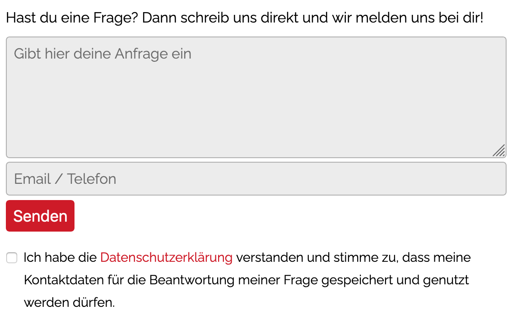

Dafür wurde [in Slack ein spezieller Endpoint generiert](https://api.slack.com/messaging/webhooks) und so konfiguriert, dass alle eingehenden Nachrichten in unserem Kanal landen. Nach außen ist der Endpoint öffentlich zugänglich, sodass keine zusätzliche Authentifizierung nötig ist. Zu beachten war nur, dass beliebige Internetnutzer die Adresse des Endpoints nun erraten oder aus dem Quellcode unserer Seite extrahieren und missbrauchen könnten. Das Risiko ist allerdings gering: im schlimmsten Fall landet eine große Menge Spam in unserem Kanal.

Als Schutzmechanismus wurde die Adresse des Endpoints im Code mit einer primitiven Caesar-Chiffre händisch verschlüsselt und [der Code zur Entschlüsselung](https://github.com/ImmunHelden/ImmunHelden.de/blob/a9c7731298/website/index.html#L37) mit [obfuscator.io](https://obfuscator.io/) verschleiert. Dies verhindert eine automatisierte Erkennung der Endpoint Adresse durch Crawler und schränkt die Gruppe der möglichen menschlichen Angreifer zumindest stark ein.
Die Nachrichten unserer Nutzer und interessierter Organisationen sind für alle Teammitglieder in Slack sichtbar und werden nach kurzer Diskussion manuell beantwortet:

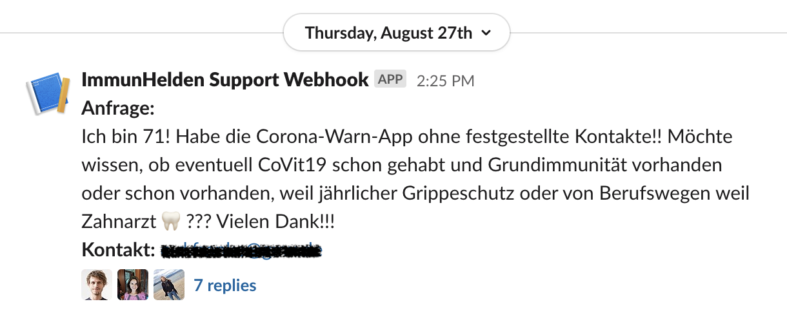

### Rekonvaleszentenplasma

Im April 2020 kamen Diskussionen zum Potential von Rekonvaleszentenplasma (RKP) Spenden auf, einerseits für die medizinische Forschung und andererseits für Immunoglobulin-Therapien. In den USA wurde die [CoViG-19 Plasma Alliance](https://www.covig-19plasmaalliance.org/) von [Microsoft technisch unterstützt](https://blogs.microsoft.com/blog/2020/04/20/) und in Großbritannien begann der NHS [Werbung für die RKP-Spende im Internet zu platzieren](https://twitter.com/GiveBloodNHS/status/1255528788529733637). Unser Team verfolgte die Entwicklung und setzte sich ebenfalls detailliert mit der RKP-Spende auseinander. Nach einigen Telefonaten mit Unikliniken und anderen Spendeeinrichtungen beschlossen wir die Daten aller Einrichtungen in Deutschland zusammenzutragen die zur RPK-Spende berechtigt waren um damit auf unserer Webseite selbst ein initiales Angebot zu schaffen.

Am 23. Mai 2020 hatten wir 136 RKP-Spendeeinrichtungen in Deutschland und Österreich verifiziert und [auf unserer Karte eingezeichnet](https://twitter.com/ImmunHelden/status/1264146588110393344), Social Media Vorschaubilder implementiert und eine gute Kompatibilität unserer interaktiven Karte für die meisten mobilen Endgeräte erreicht. Zudem hatten wir in der Zwischenzeit einen [umfangreichen Frage-Antwort-Katalog (FAQ)](https://immunhelden.de/faq/) speziell zur RKP-Spende veröffentlicht.

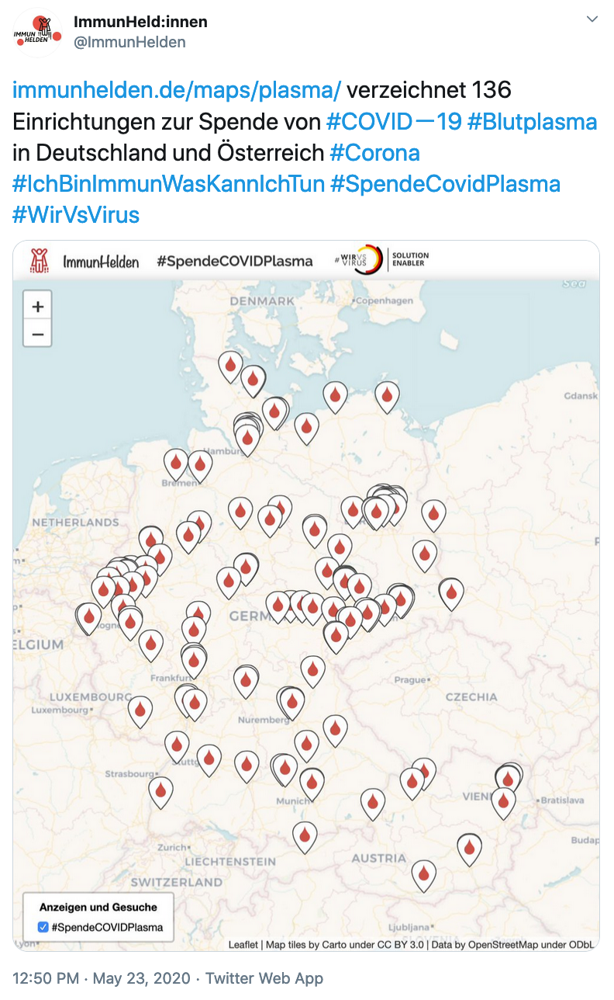

## Strategische Variationen und fortschreitende Entwicklung der Pandemie

Im Zuge der sich abzeichnenden Entspannung des Infektionsgeschehens und der Lockerungen der Kontaktbeschränkungen ab Mai 2020 ließ auch die Hilfsbereitschaft innerhalb der Bevölkerung spürbar nach. Die Menschen konnten endlich wieder ihren gewohnten Tätigkeiten und Hobbies nachgehen und auch in den Medien gab es (glücklicherweise) wieder andere Themen. Für die Verbreitung unserer Plattform war das allerdings eher kontraproduktiv.

### Social Media Kampagne mit Vodafone Institute

Eine Social Media Kampagne mit dem [Vodafone Institute in der zweiten Juniwoche](https://twitter.com/vf_institute/status/1269885267592298497) versprach uns eine gewisse mediale Aufmerksamkeit. Sie war für den englischsprachigen Raum konzipiert und mit unserem Erklärvideo auf Englisch auch gut multimedial unterstützt. Um mögliche Partner im europäischen Ausland zu gewinnen (wie zuvor bereits BioLife in Österreich) hatten wir eigens eine englische Version unserer Webseite vorbereitet und unter [ImmunHelden.eu](https://immunhelden.eu/) veröffentlicht.

Leider blieben die erhofften Zuwächse unserer Nutzerzahlen aus. Ebenfalls konnten wir keine RKP-Spendeeinrichtungen außerhalb des deutschsprachigen Raumes gewinnen. Die genaue Zahl der Besucher auf unserer Seite konnten wir zu diesem Zeitpunkt leider nicht beziffern, da wir zugunsten des Datenschutzes auf eine Aufzeichnung der Seitenaufrufe und eine Analyse von Nutzerprofilen verzichtet hatten. Das machte es schwieriger gute Rückschlüsse für die kommenden Iterationen zu ziehen.

### Tracking von Besucherzahlen und ausgewählten Interaktionen

In der Folge entschieden wir uns für eine sanfte Abkehr von unserer harten Datenschutzlinie. Wir [bauten ein Cookie Banner ein](https://github.com/ImmunHelden/ImmunHelden.de/commit/f4e5f9c842bcd310e3494d3b4cb7b0e599bd3313), um beim ersten Besuch unserer Seite über das Tracking zu informieren und zeichneten fortan die Anzahl von Seitenaufrufen mit [Matomo](https://immunhelden.matomo.cloud) auf. Dabei handelt es sich um eine kostenpflichtige Alternative zu Google Analytics, bei der keine Daten an Dritte weitergegeben oder durch Matomo selbst weiterverarbeitet werden.

Dieser Kompromiss erlaubte es uns außerdem fortan bestimmte Nutzerinteraktionen in unseren Update E-Mails zu zählen. In der folgenden Bildschirmaufnahme ist die Benutzeroberfläche zu sehen, in der das Versenden einer Updatecharge auszulöst wird. D.h. mit einem Klick auf *Submit Query* bekommen all unsere Nutzer eine E-Mail zu den aktuellen Angeboten in ihrer Region. Während die Seite selbst [öffentlich zugänglich](https://immunhelden.de/sendUpdateMails?template=/email/de/hero_updates.md) ist, können tatsächliche E-Mails natürlich nur nach Eingabe des korrekten Passworts versendet werden. Zu sehen ist eine Vorschau anhand von Demodaten:

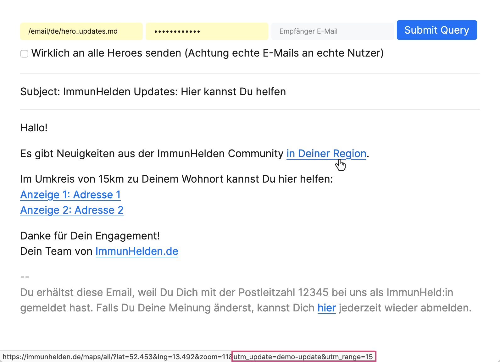

Bei der Betrachtung der verlinkten Seiten wird deutlich, dass die Zielseite bestimmte Tags registriert. Der Link *in Deiner Region* beispielsweise übermittelt Daten zur Updatecharge (hier "demo-updates") und dem vom Algorithmus gewählten Umkreis (hier 15km).

Unsere Messungen in den folgenden Wochen machten klar, dass unsere ortsbasierten Updates fast keine der bereits registrierten Nutzer zurück auf unsere Seite lockte. Auf die allgemeinen Besucherzahlen blieben gering. Das folgende Diagramm zeigt die akkumulierte Anzahl von Besuchern pro Woche:

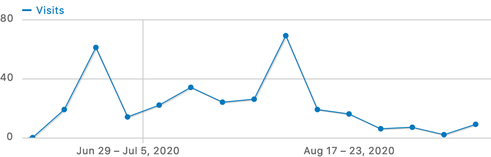

### Eigene Social Media Kampagnen

Um unsere Präsenz in den sozialen Medien trotz geringen Zuspruchs und vorübergehend abklingender Pandemie zu erhalten, entschlossen wir uns unsere multimedialen Ressourcen selbst stärker zu verbreiten.

Bereits im Mai hatten wir gemeinsam mit der [Firma YouKnow](https://you-know.de/) für unsere Webseite [Erklärvideos in deutscher und englischer Sprache](https://www.youtube.com/channel/UC1cCZ_OYkbLXCp9nQh7SMJw) produziert. Im Juni 2020 kam ein Podcast mit [Bayern Innovativ](https://soundcloud.com/user-38129353/podcast-05-immunheldende-gemeinsam-gegen-corona) hinzu und eine Vorstellung unseres Projekts im [Coronahelden Podcast auf Spotify](https://open.spotify.com/episode/6nrMw9mkRnxFL2pSbcUSKy). Zudem nutzten wir unsere detaillierte FAQ um unseren Followern auf Instagram unter dem Titel [7 Tagen 7 Fragen](https://www.instagram.com/stories/highlights/17845137686197725/) ein tägliches Quiz zu servieren und es an unsere Kanäle auf Twitter, Facebook und LinkediIn weiterzuleiten.

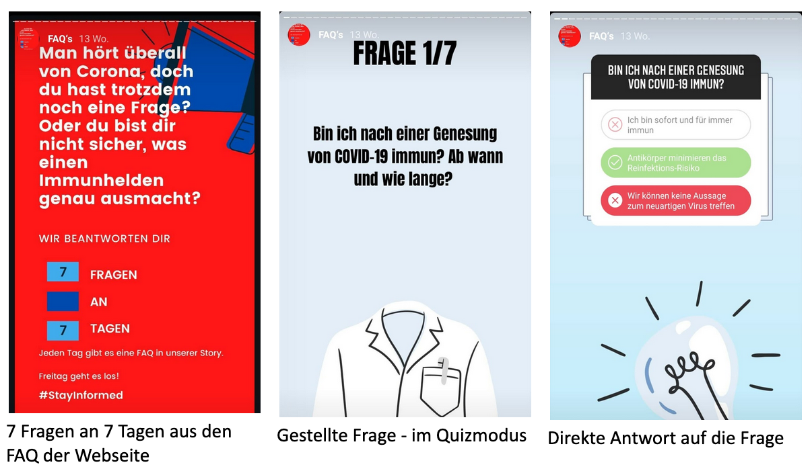

### Partnerorganisationen und der Begriff der Immunität

Die Kommunikation mit potentiellen Partnern war nicht immer leicht. Es ließ sich auf zwei wesentliche Punkte zurückführen.

Einserseits umfasst unsere Zielgruppe vor allem Einrichtungen im sozialen Bereich die bereits im Normalbetrieb oft unterbesetzt sind. Dazu kommt, dass die technische Ausrüstung oft in der Zeit der Installation stecken geblieben ist und es bei der Kompetenz im Umgang damit Schwierigkeiten gibt. Das äußerte sich in E-Mails, die nicht oder erst nach langer Wartezeit beantwortet wurden. Oder auch in verunsicherten Nachfragen, weil unsere interaktive Karte im "Internet Explorer der 1990er Jahre" nicht korrekt dargestellt wurde. Gute und positive Rückmeldungen gab es in Telefonaten, doch die Follow-ups blieben dann oft wieder unbeantwortet und selbst die seltenen Zusagen oft schwammig.

Andererseits blieb das Thema der Immunität von COVID-19 immer heikel. Zwar war es allgemein bekannt, dass das Personal innerhalb von Krankenhäusern und Seniorenheimen schon früh danach eingeteilt wurde, ob jemand bereits eine Infektion überstanden hatte oder nicht. Doch für die Kommunikation nach außen und das Anwerben von Hilfskräften konnte das nicht ohne Weiteres übernommen werden.

In der Öffentlichkeit war der Diskurs zu Immunitätsausweisen seit einem [Gesetzesentwurf der Bundesregierung im Mai 2020](https://de.wikipedia.org/wiki/Immunitätsausweis#Verlauf) in vollem Gange. Nach wissenschaftlichem Kenntnisstand wurde [eine gewisse Immunität zwar schon lange für sehr wahrscheinlich gehalten](https://www.ndr.de/nachrichten/info/15-Coronavirus-Update-Infizierte-werden-offenbar-immun,podcastcoronavirus136.html), doch klar war auch, dass sich dies nur sehr schwierig beweisen ließ. Unter diesen Umständen setzte sich (zurecht) die sozialrechtlich getriebene Argumentation durch, dass die Wahrung der Gleichbehandlung aller Menschen gegenüber den Vorteilen einer Ausweisung von Immunität Vorrang hat. Dies wurde im September 2020 letztlich durch die [Empfehlung des deutsch Ethikrats](https://www.ethikrat.org/mitteilungen/2020/deutscher-ethikrat-raet-derzeit-von-covid-19-immunitaetsbescheinigungen-ab/) offiziell bestätigt.

Leider ging unser Anliegen in dieser alles-oder-nichts Abwägung etwas unter: Während eine Immunität natürlich nicht zum persönlichen Vorteil genutzt werden sollte, hätte der Einsatz für das Gemeinwohl doch sehr wohl sinnvoll sein können. Die mit der Komplexität der Thematik einhergehende Polarisierung in der Diskussion belastete den Immunitätsbegriff jedoch stark. Auf eine detaillierte Betrachtung ließ sich in der Folgezeit nur noch schwer aufbauen.

### Selbstverwaltungsbereich für Partnerorganisationen

Im Mai 2020 begannen wir an einem [Selbstverwaltungbereich](https://dev.immunhelden.de/de/partner/) zu arbeiten. Es versprach uns eine große Zeitersparnis beim Abgleich und der Eingabe von Detailinformationen und unseren Partnern einen direkten Weg ihre Anzeigen selbst zu erstellen und zu aktualisieren.

Aufgrund von technischen Präferenzen im Team entschieden wir uns für das [Webframework ReactJS](https://reactjs.org/) und den Einsatz von [Material UI Komponenten](https://material-ui.com/). Die Entscheidung für einen Hosting-Anbieter war bereits während des Hackathons auf [Firebase](https://firebase.google.com/) gefallen, was gut zusammen passte, da hier serverseitig eine [NodeJS](https://nodejs.org/) Umgebung bereitgestellt wird. Nicht wirklich nötig aber interessant war der Einsatz des [Static-Page-Generators](https://www.hosteurope.de/blog/die-besten-static-website-generatoren/) [Gatsby](https://www.gatsbyjs.com/), der zur Built-Zeit fertige HTML Dateien erzeugt, die zur Laufzeit von [ReactJS wieder dynamisch ergänzt](https://www.gatsbyjs.com/docs/react-hydration/) werden. Dies trägt bei häufigen Seitenaufrufen zu einer leichten Verringerung von Wartezeiten für Nutzer und Serverlast für unser Hosting bei. Der Quellcode des Selbstverwaltungsbereichs findet sich natürlich [auf GitHub](https://github.com/ImmunHelden/ImmunHelden.de/tree/master/new-website).

Die folgende Bildschirmaufnahme zeigt die Benutzeroberfläche die eine Übersicht aller Anzeigen eines Nutzers auflistet und alle nötigen Interaktionen für die Verwaltung bereitstellt: Anzeigen können erstellt, bearbeitet, gelöscht, sortiert und über einen Suchbegriff gefiltert werden:

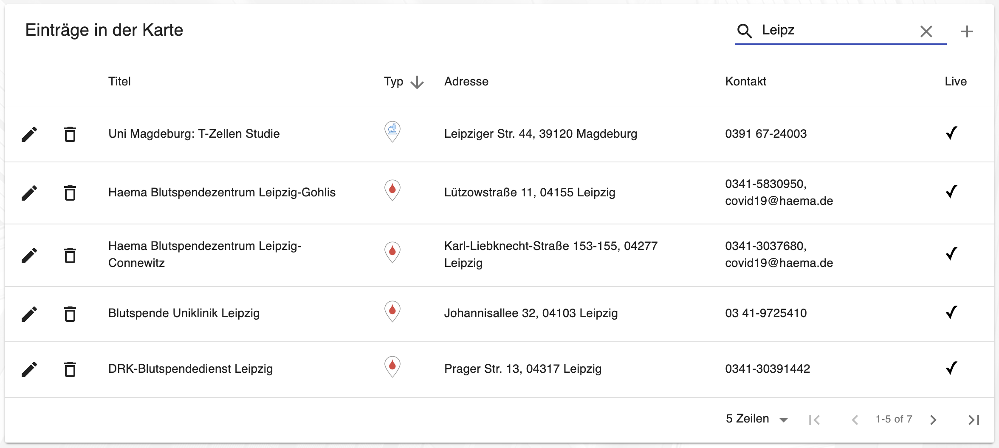

Die Bearbeitung erfolgt über eine separate Eingabemaske. Hier können Titel, Kontaktdaten, Kategorie und andere Informationen eingeben werden. Die Adresse wird automatisch in Kartenkoordinten übertragen, die im Zweifel manuell nachjustiert werden können. Für den Beschreibungstext stehen einfache Möglichkeiten zur Formatierung bereit:

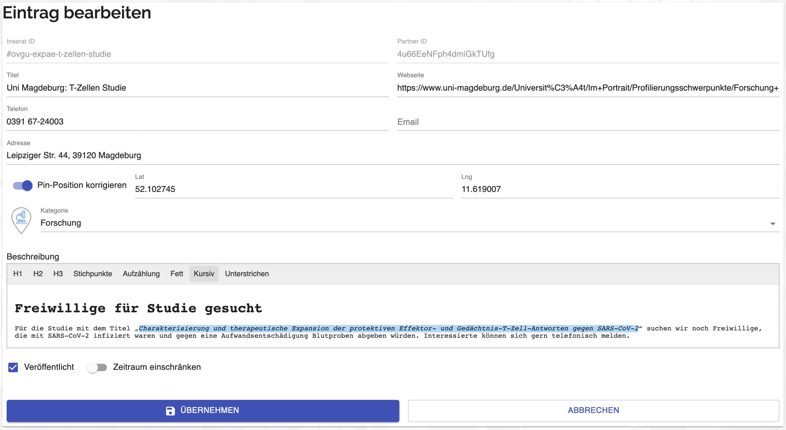

Sobald ein Eintrag angelegt und das Feld *Veröffentlichen* aktiviert wurde, erscheint er auf unserer interaktiven ImmunHelden Map und kann dort entweder manuell oder über einen Permalink gefunden werden. Der Eintrag im Bild oben beispielsweise kann über diesen Link erreicht werden: https://immunhelden.de/maps/all/#ovgu-expae-t-zellen-studie

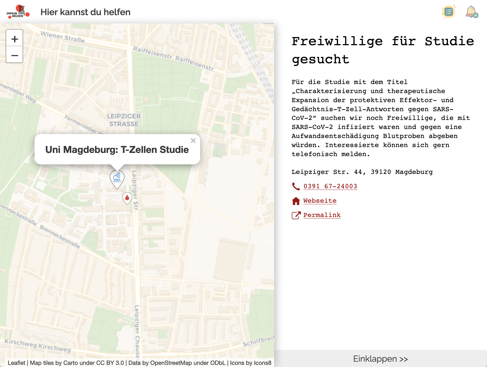

Als Plattformbetreiber werden wir per E-Mail informiert, wenn neue Einträge angelegt werden. Dies dient sowohl dem Support für unsere Partnerorganisationen als auch der Vorbeugung von potentiellem Missbrauch der Plattform. Sollten wir bei einer Überprüfung irrtümliche oder fehlleitende Einträge entdecken, können wir die Autoren darüber informieren. Darüber hinaus steht uns (neben dem direkten Zugriff des Administrators auf die Datenbank) ein Administrationszugang zum Selbstverwaltungsbereich zur Verfügung, über den die Anzeigen aller Partner über die gewohnte Eingabemaske überarbeitet werden kann.

### Partnerorganisationen außerhalb der RKP-Spende

Mit der Stuttgarter Tafeln e.V. und der Berliner Stadtmission e.V. konnten wir im Juni 2020 zwei Partnerorganisationen außerhalb der RKP-Spende gewinnen. Das gab uns die Gelegennheit die Darstellung unserer Anzeigen anhand von praktischen Beispielen weiterzuentwickeln.

In Anzeigen zu RKP-Spenden waren Informationen zu Name, Ort und Kontakt bisher ausreichend. Für die Beschreibung von Tätigkeiten und Anforderungen kamen jedoch schnell längere Texte zusammen, die ohne Formatierung weder ansprechend aussahen noch übersichtlich waren. Im Selbstverwaltungsbereich wurde Eingabemaske zum Editieren von Anzeigen daraufhin um einfache Textformatierungen ergänzt. Für die Implementierung der Benutzeroberfläche nutzten wir die [DraftJS Komponente](https://draftjs.org/) und für die Konvertierung von Markdown nach HTML [ShowdownJS](http://showdownjs.com/). Zudem führten wir die Kategorieauswahl ein und eine Möglichkeit festzulegen in welchem Zeitraum eine Anzeige aktiv sein soll.

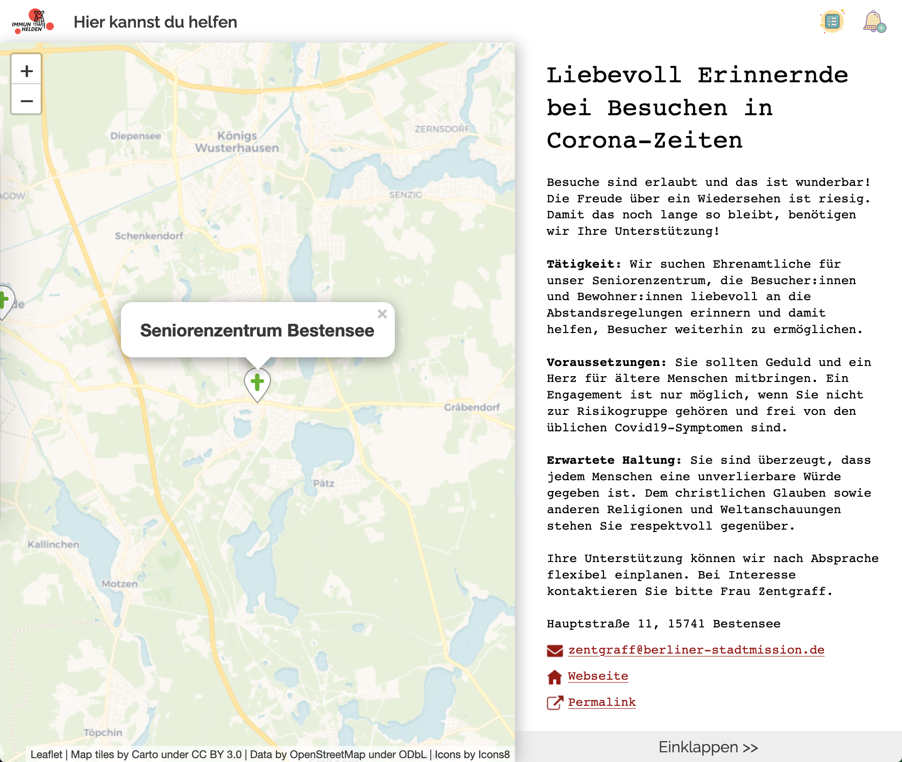

Um die neuen Funktionen zu testen, legten wir die ersten Anzeigen dieser Art noch selbst an, indem wir Flyer nachahmten, die uns zur Verfügung gestellt wurden. Im weiteren Verlauf war das Ziel jedoch, Partnerorganisationen dazu zu bewegen diese Aufgabe selbst zu übernehmen. Damit waren wir leider nicht erfolgreich. Anfangs war der Anmeldeprozess noch etwas holprig, später wurde es leider von keinem unserer potentiellen Partner mehr versucht. Offenbar war die Aussicht zu gering auf diesem Weg neue Helfer anzuwerben, als dass es den Aufwand gerechtfertigt hätte sich in den Selbstverwaltungsbereich einzuarbeiten.

### Eine ImmunHelden Map für alles

Die Basisversion unserer interaktiven Karte [entstand bereits am Wochenende des Hackathons](https://github.com/ImmunHelden/ImmunHelden.de/commit/eaaa5288a0910fe3a285225b011eaf83aa4147b1) und wurde über den gesamten Zeitraum des Projekts weiterentwickelt. So entstanden Funktionen für verschiedene Pin-Typen, die Darstellung einer Legende, das Einbinden der Karte in andere Seiten, das Nachladen von Pin-Positionen und Anzeigendetails im Hintergrund, eine Seitenleiste mit Kategorieauswahl und Abonnement-Funktion und vieles mehr.

Eine Richtungsentscheidung hatten wir mit der generalisierten API getroffen, die es ermöglichen sollte die Karte gemeinsam mit anderen Initiativen zu nutzen. Das setzte voraus, dass die Kartenkomponente basierend auf ihrer Konfiguration dynamisch verschiedene Endpoints abfragen und die resultierenden Daten darstellen konnte. Um dies ohne praktisches Beispiel zu skizzieren, hatten wir unsere eigenen Daten einfach anhand ihrer Kategorien (RPK-Spende, Tafel und Stadtmission) unterteilt und über verschiedene Endpoints zugänglich gemacht. Diese Endpoints konnten dann frei kombiniert werden, um die Implementierung der Karte zu testen.

Nachdem nun einige Monate ohne Kooperationsaussichten vergangen waren und wir in der Praxis immer nur diejenige Karte nutzten, die alle Daten anzeigte, konnte das Konzept offen infrage gestellt werden. Anlass dafür bot die Beobachtung, dass mit jeder neuen Kategorie die zeitliche Verzögerung beim Laden der Karte wuchs. Zwar wurden die Pins der einzelnen Kategorien nach und nach angezeigt, doch wirklich nutzbar war die Karte erst dann wenn die Daten aller Pins angekommen waren. Die Bündelung aller Daten in einem einzigen Endpoint erwies sich natürlich als deutlich performanter und [wurde in der Folge umgesetzt](https://github.com/ImmunHelden/ImmunHelden.de/commit/a4220229bfe8756c8872f575184b2c9d7afcb54d). Eine potentielle Nutzung gemeinsam mit anderen Initiative ist damit nicht unmöglich geworden, denn noch immer bezieht die Kartenkomponente die Adressen ihrer Quell-Endpoints aus ihrer Konfiguration. Doch da das Feature nicht mehr aktiv genutzt wird, ist es sehr wahrscheinlich, dass es bei einer nachfolgenden Änderung unbemerkt zerbricht.

### ImmunHelden-Updates

Ortsbasierte Update E-Mails gehören zu der Kernfunktionalität unserer Plattform. Organisationen geben dafür die Adressen ihrer Standorte an und Freiwillige ihrer Postleitzahl. Entfernungsmessungen können anhand dieser Daten jedoch nicht erfolgen. Dafür braucht es Kartenkoordinaten mit Latitude und Longitude, die sicher keiner unserer Nutzer manuell eingeben möchte.

Für Adressen werden Kartenkoordinaten über den [Geo-Coding Service von LocationIQ](https://locationiq.com/) ermittelt. Unser kostenloser Account ist dabei in Anfragen pro Minute begrenzt. Da wir eine Ausflösung von Adresse nach Koordinaten nur dann benötigen, wenn im Selbstverwaltungsbereich eine neue Anzeige erstellt wird, sollte dies jedoch kein Problem darstellen. Im Falle einer kurzfristigen Überschreitung des Limits kommt ein [einfaches Retry-Verfahren](https://github.com/ImmunHelden/ImmunHelden.de/blob/676915f24a1d5cc322e7d5858cd70df4a3365def/new-website/src/components/location/edit-form.jsx#L63) zum Einsatz.

Postleitzahlen werden [über eine Zuordnung zu ihren Centroiden](https://github.com/ImmunHelden/ImmunHelden.de/blob/35afbc3260f7f11127098ffacbed9bd54bed29d4/functions/message-templates.js#L158) (dem Schwerpunkt des Postleitzahlbereichs) in Kartenkoordinaten überführt. Die Datengrundlage dafür wurde von [suche-postleitzahl.org](https://www.suche-postleitzahl.org/) importiert und [im Format für unsere Zwecke angepasst](https://github.com/ImmunHelden/ImmunHelden.de/blob/master/functions/zip2latlng.json).

Sollen nun alle Standorte in der Nähe eines Nutzers bestimmt werden, wird zunächst der Centroid seines Postleitzahlbereichs ermittelt und davon ausgehend die [Entfernungen zu allen bekannten Standorten berechnet](https://github.com/ImmunHelden/ImmunHelden.de/blob/35afbc3260f7f11127098ffacbed9bd54bed29d4/functions/message-templates.js#L379). Für diese Berechnunng kommt die [Haversine Formel](https://en.wikipedia.org/wiki/Haversine_formula) zum Einsatz. In der Liste der Ergebnisse wird nun abgewogen: Gibt es mehr als einen Standort innerhalb einer Entfernung von 5km, fällt die Entscheidung auf diese; andernfalls werden in der Update E-Mail alle Standorte innerhalb von 15km aufgelistet. Sollte innerhalb dieser Bereiche kein einziger Standort gefunden werden, wird keine E-Mail versendet.

### Chatfunktion und Video-Ident-Verfahren

Aufgrund der weiterhin mangelnden Nachfrage Chat nicht implementiert und Jitsi nicht eingebunden.
