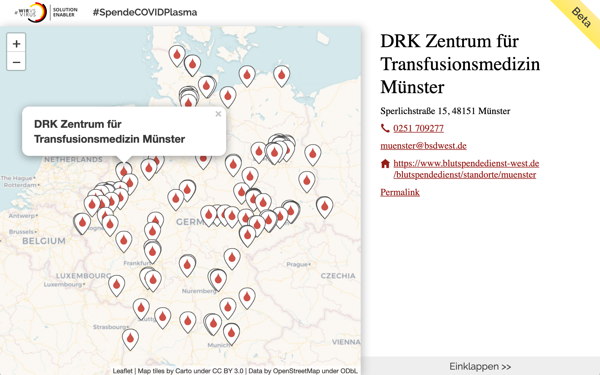
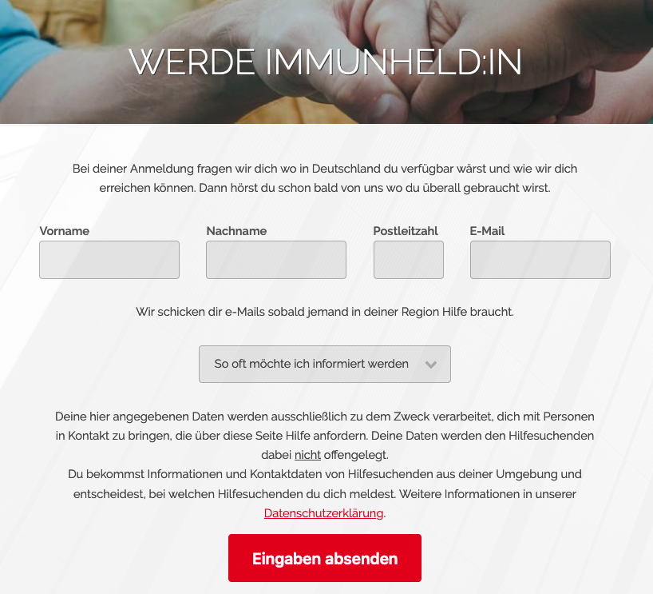
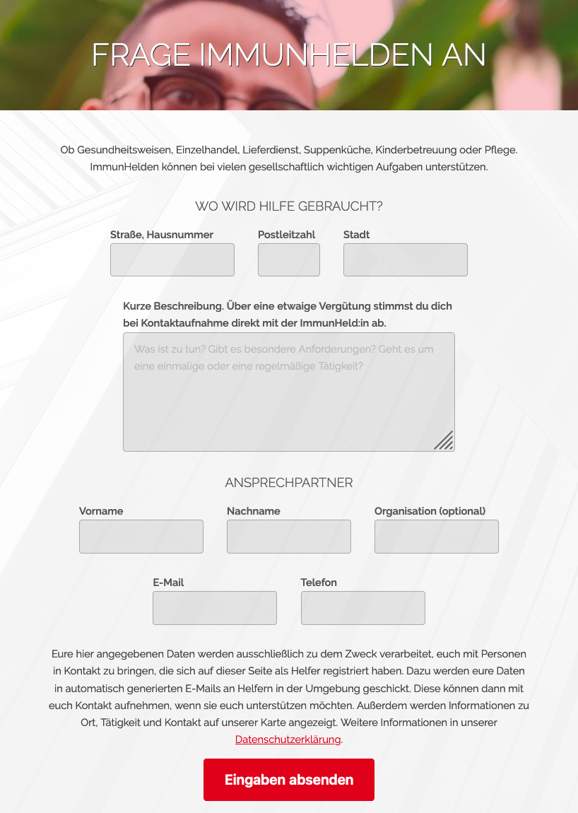

<h1>
  
  ImmunHelden.de
</h1>

Superhelden gibt es nicht? Jeder denkt nur an sich? Stimmt nicht! Wir verbinden von COVID-19 genesene und damit immune Helfer:innen mit allen, die ihre Unterstützung benötigen.
  

## Mission

Wir prägen den Begriff “ImmunHelden” für Menschen, die von COVID-19 genesen sind und ihre Immunität für die Bewältigung der Corona Pandemie im Sinne des Gemeinwohls nutzen. Unsere Plattform bündelt Angebote zu Tätigkeiten für deren Ausübung Immunität außerordentlich wertvoll ist. Zunächst zeigen wir Möglichkeiten zur Blutspenden für die Antikörperforschung auf. In Zukunft möchten wir unser Angebot auf weitere Tätigkeiten ausdehnen. Dafür entwickeln wir ein Vermittlungsverfahren, das die Identität unserer ImmunHelden schützt und ohne die Speicherung von Gesundheitsdaten auskommt. Denn jeder Genesung geht eine Erkrankung voraus und eine Immunität wird nur durch Ergebnisse klinischer Untersuchungen belegt werden können.

## Stand

Schon heute findet sich auf unserer [interaktiven Karte](https://immunhelden.github.io/WirVsVirusMap/plasma.html) eine große Zahl von Einrichtungen, die eine Spende von Rekonvaleszenten-Plasma ermöglichen:

   

Zukünftige ImmunHelden können sich bei uns registrieren, um über neue Angebote in ihrer Region informiert zu werden. 

   

Organisationen die Unterstützung suchen, können sich registrieren und eine Beispielanzeige formulieren. Für weitere Details werden wir uns in Kürze bei ihnen melden.

  

Natürlich ist unser Angebot an alle ImmunHeld:innen da draußen gerichtet.

# Links

* [ImmunHelden DevPost](https://devpost.com/software/immuneheros)
* [Firebase App](https://immunhelden.firebaseapp.com)
* [Twitter](https://twitter.com/ImmunHelden)
