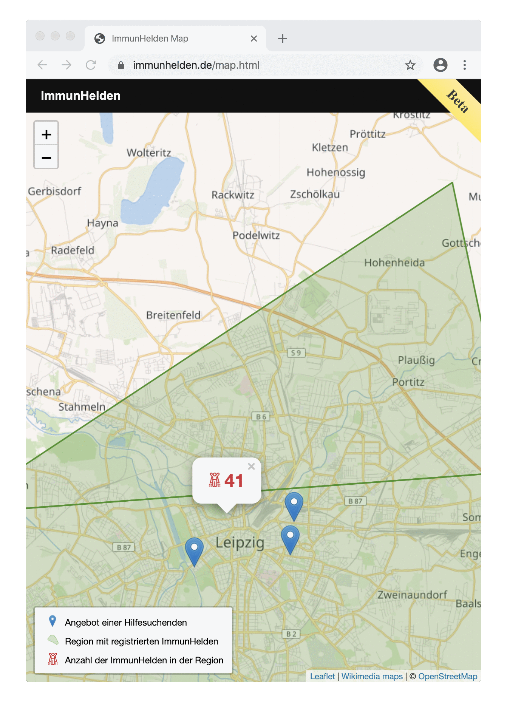
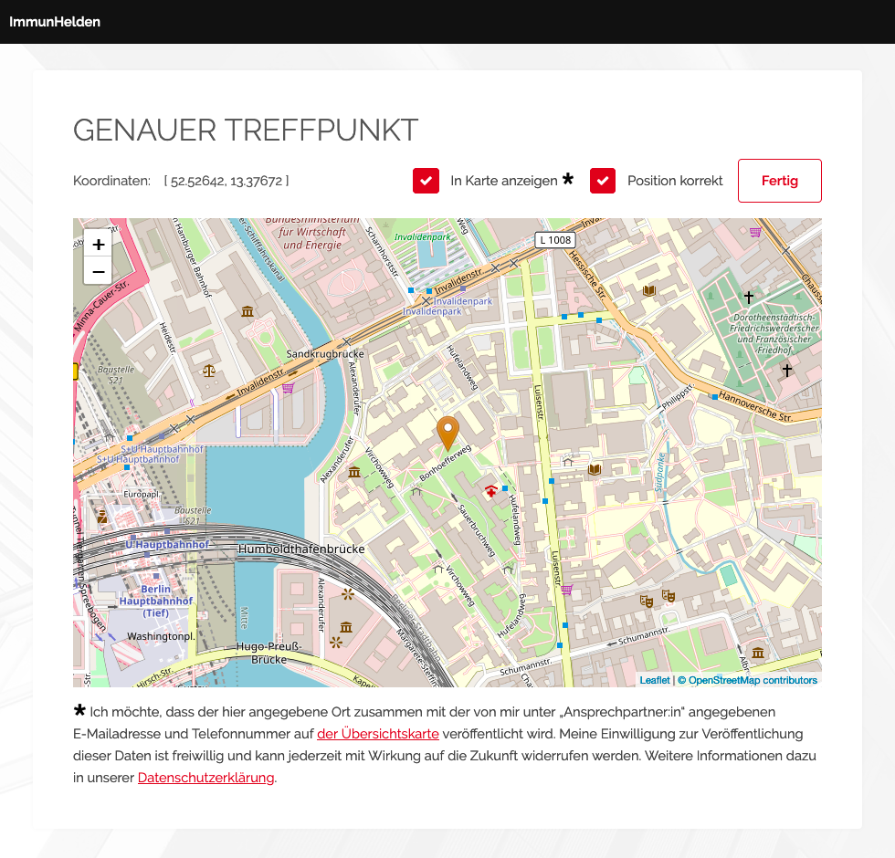

# [ImmunHelden.de](ImmunHelden.de)

Wir verbinden von COVID-19 genesene und damit immune Helfer:innen mit allen, die ihre Unterstützung benötigen.

Unsere interaktive ImmunHelden Map ermöglicht einen schnellen Überblick und bietet einen direkten Zugang für alle Helfenden:

## Stand

Das Projekt wurde im März 2020 im Rahmen des [#WirVsVirus Hackathons](https://wirvsvirushackathon.org/) der deutschen Bundesregierung entwickelt. Es wurde großer Wert auf den Schutz personenbezogener Daten gelegt.

Auf dem aktuellen Stand könnte ein früher Betatest bereits beginnen, denn die Komponenten zur Eingabe, Speicherung und Darstellung der Nutzerdaten sind bereits verfügbar. Andere Bereiche der [Implementierung sind noch unvollständig](https://github.com/weliveindetail/ImmunHelden.de/issues). Diese könnten jedoch während der Anlaufzeit eines Betatests innerhalb kurzer Zeit ergänzt werden.

Die Implementierung kann unter [ImmunHelden.de](ImmunHelden.de) anhand von Beipieldaten ausprobiert werden.

## Features

ImmunHelden registrieren sich schnell und mit einem Minimum an personenbezogenen Daten. Im Vermittlungsverfahren wird keine dieser Angaben weitergegeben oder öffentlich angezeigt. Sinn der Registrierung ist es, bei Eingang neuer Hilfsgesuche in der eigenen Region benachrichtig zu werden.

Im Formular zur Registrierung von Hilfesuchenden werden mehr Informationen benötigt. Im ersten Schritt wird das Hilfegesuch und die Kontaktdaten des Ansprechpartners angegeben. Diese werden später an interessierte ImmunHelden in der Nähe weitergeleitet.

Im zweiten Schritt werden die für die Adresse ermittelten Koordinaten überprüft. Die Hilfesuchende kann die Position auf der Karte nachjustieren, um den gewünschten Treffpunkt möglichst genau darzustellen. Außerdem kann sie die Darstellung auf der ImmunHelden Map nach Wunsch abwählen (für Organisationen Opt-out, für Privatpersonen Opt-in).

Natürlich ist unser Angebot an alle ImmunHeld:innen da draußen gerichtet.

# Links

* [ImmunHelden DevPost](https://devpost.com/software/immuneheros)
* [Firebase App](https://immunhelden.firebaseapp.com)
